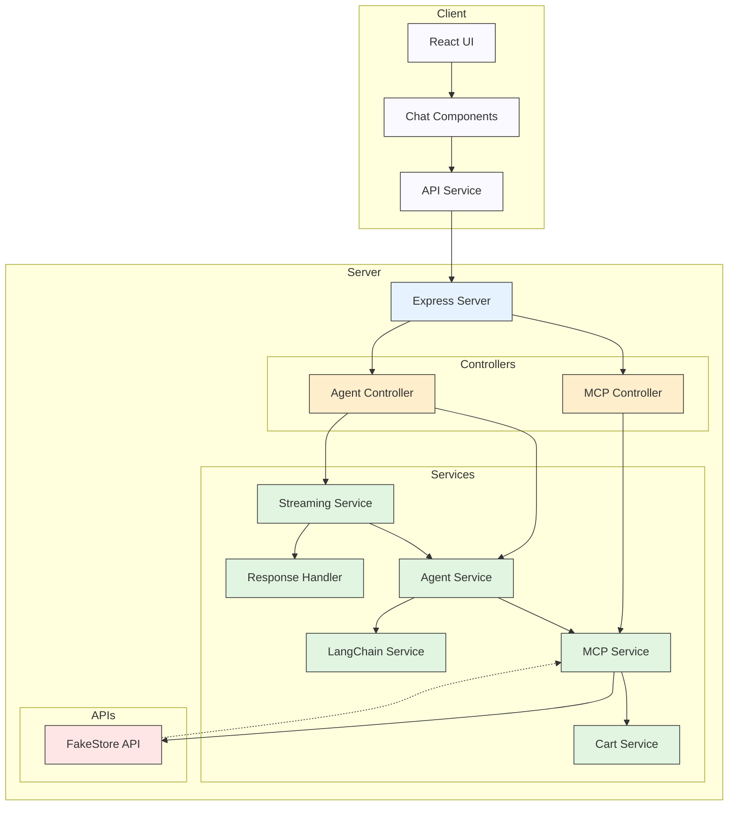
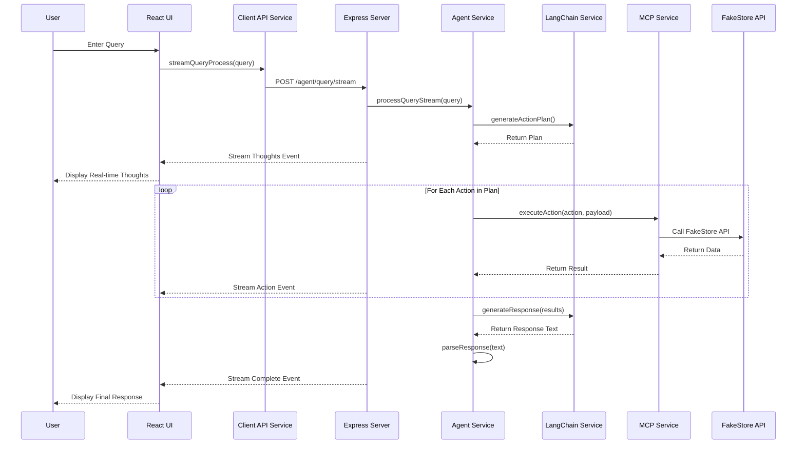
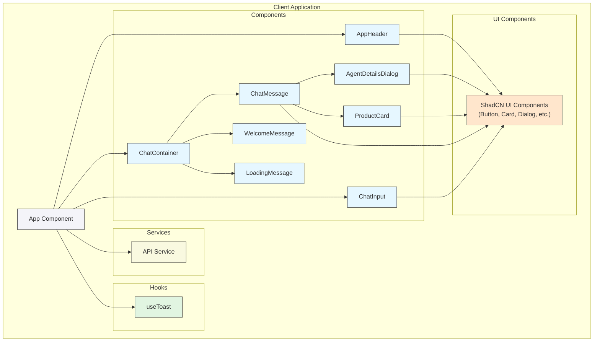
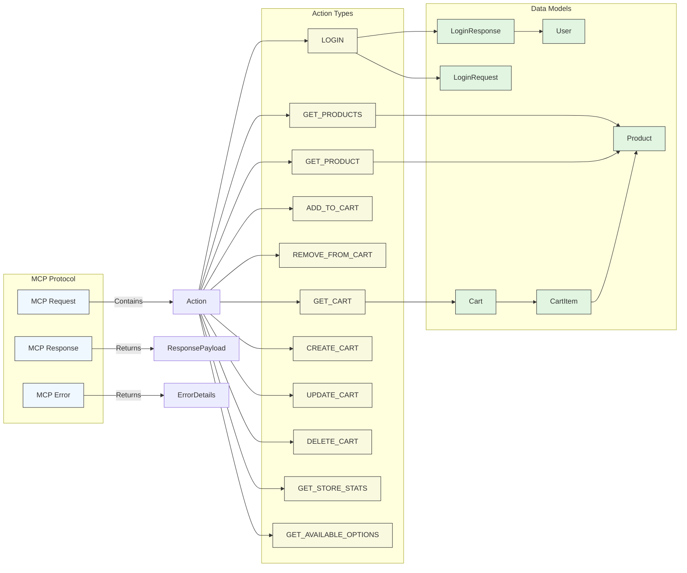

# FakeStore MCP with LLM Agent

A modern e-commerce store with a sleek, elegant UI and LLM-powered search capabilities.

## Product Demo (Client + MCP Architecture)
https://www.youtube.com/watch?v=uhaueWv50xg

## Features

- **Beautiful Chat Interface**: Inspired by ChatGPT but with an Apple/Linear.app aesthetic
- **Real-time AI Thought Process**: See the actual LLM reasoning in real-time as it processes queries
- **LLM-Powered Intelligence**: Natural language product search, filtering, and sorting
- **Elegant Product Cards**: Clean, minimalist design showcasing product information
- **Agent Details View**: See exactly how the AI processed your request
- **Responsive Design**: Works beautifully on all devices

## Project Structure

- `server/` - Express.js backend with MCP (Model Context Protocol) implementation
- `client/` - Modern React frontend with shadcn/ui components
- `client/` - CLI client for testing the LLM agent
- `shared/` - Shared types and interfaces

## Setup

1. Clone the repository
2. Install dependencies:
   ```
   npm install
   cd client && npm install
   ```
3. Create a `.env` file in the server directory with your OpenAI API key:
   ```
   OPENAI_API_KEY=your_openai_api_key
   ```

## Running the Application

### Run Everything Together
```
npm run dev:all
```
This will start both the backend server and the React frontend.

### Backend Server Only
```
npm run start:server
```

### Frontend Only
```
npm run frontend:dev
```

### CLI Interface
```
npm run agent
```

## User Interface

The application features a modern, sleek chat interface:

1. **Welcome Screen**: Quick suggestion buttons to help users get started
2. **Chat Messages**: Clean message bubbles with user and AI responses
3. **Live Thought Process**: See the actual reasoning of the LLM in real-time as it analyzes your query
4. **Product Cards**: Elegant cards showing product images, prices, and details
5. **Agent Details**: Expandable dialog showing the LLM's thought process and API calls

## Real-time Thought Process

One of the most innovative features of this application is the ability to see the LLM's actual thought process in real-time as it works through your query. This provides unprecedented transparency into how the AI makes decisions, such as:

- How it interprets user queries
- What API endpoints it chooses to call
- How it determines which filters to apply
- The reasoning behind its product recommendations

This feature is implemented through a streaming server-sent events (SSE) connection that pushes the LLM's thoughts to the frontend as soon as they're available, creating a more engaging and educational user experience.

## Technologies

- **Frontend**: React, TypeScript, shadcn/ui, Tailwind CSS, Lucide icons
- **Backend**: Express.js, TypeScript, OpenAI GPT, LangChain
- **Data**: FakeStore API for product information
- **Streaming**: Server-Sent Events (SSE) for real-time thought process display

## Architecture Diagrams

### System Architecture



### Chat Interaction Flow



### Client Component Architecture



### MCP (Model Context Protocol) Data Flow



## License

ISC 
